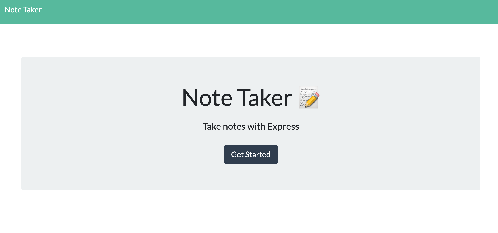

<h1> Express Note Taker</h1>

<h2>Project Details</h2>

This full stack web application allows a note taker to write, save, view, and delete notes. This application uses "express" in the back end, and saves the note by fetching data from the JSON file in the "db" folder. 

To start the server, simply open the terminal and run: "nodemon server.js" if you have nodemon installed. Otherwise, use "node server.js"

<h2>Images</h2>

<h2>Questions</h2>

Github username: lhutchinson22

For a look at my repositories click this link: https://github.com/lhutchinson22

You can reach me at my email address: lbhutchinson022@gmail.com, if you have any questions at all!

